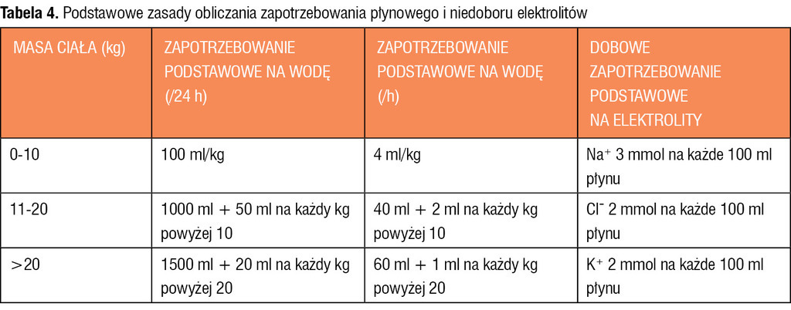

# Pytania 3

[TOC]

## 14.1 Niemowlę 10kg przyjęte do szpitala z biegunką od 3 dób, ostatni raz oddało mocz 6h temu, apatyczne, śluzówki podsychające, fałd skórny powoli się rozprostowuje. Diagnostyka, jaki to stopień (raczej II stopień) odwodnienia, jakie postępowanie (u doc. Pawelec najpierw różnicuj, czy odwodnienie jest hipo/hiper/izotoniczne)

**Odwodnienie u dzieci - red flags**
zły lub pogarszający się stan ogólny
rozdrażnienie / senność i apatia
zapadnięte gałki oczne
tachykardia
tachypnoe
obniżone napięcie skóry.
Czerwone flagi pozwalają identyfikować dzieci z ryzykiem zagrażającego wstrząsu!

wg Hollidaya i Segara

## 14.2 Hemofilia - objawy, rozpoznanie, leczenie 

## 14.4 Kaszel - diagnostyka różnicowa (docent Kuchar pyta o odruch kaszlowy i jak wygląda droga odruchu + kaszel psychogenny czym się charakteryzuje) 

## 16.1 Róża

## 16.2 Niedokrwistość z niedoboru Fe

## 16.3 Kawasaki

## 18.1 Przypadek z pylorostenozą odźwiernika, diagnoza, diagnostyka,leczenie

## 18.2 Powiększone węzły chłonne- przyczyny, diagnostyka

## 18.3 Opóźnione dojrzewanie płciowe- diagnostyka

## 19.1 5-letnie dziecko połknęło baterię. Co zalecisz?

## 19.2 Skazy małopłytkowe u dzieci - podział, objawy, rozpoznanie

## 19.3 Zapalenie mięśnia sercowego / Nabyte wady serca

