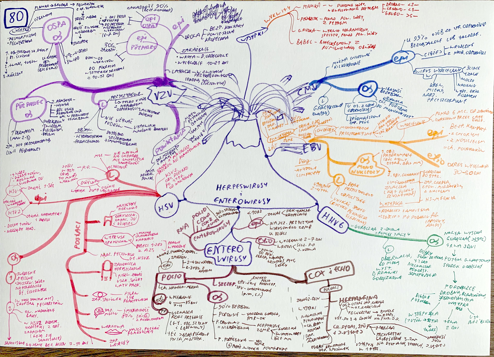
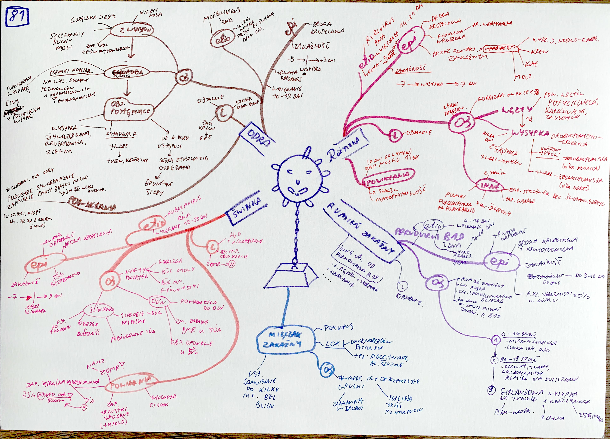
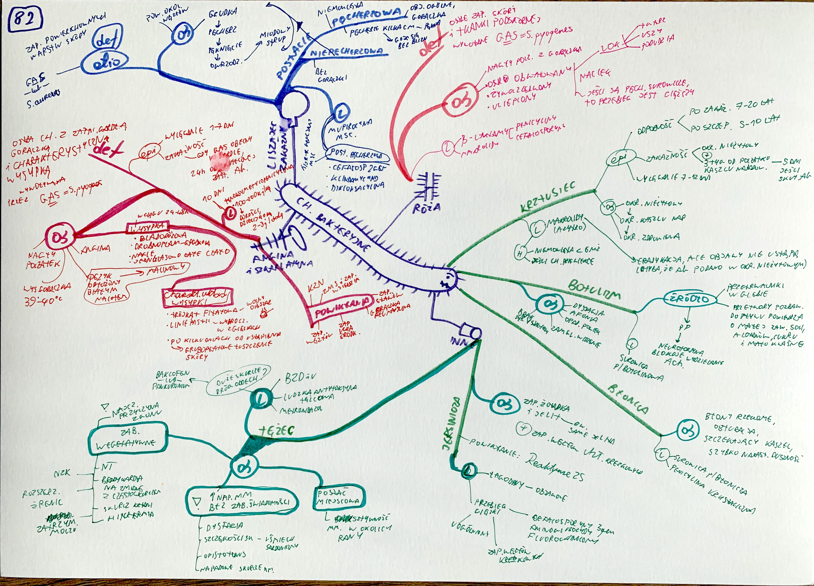

# Pytania 8

[TOC]

## x8.1 ZOMR

## x8.2 Krwawienie z dopp

już było

## x8.3 Zapalenie oskrzelików 

## x9.1 antybiotykoterapia w zapaleniach gdo

## x9.2 przypadek z atopowym zapaleniem skóry

## x10.1 RSV (można zabłysnąć z programem lekowym dla wcześniaków pawlizumab

było zapalenie oskrzelików, chyba, że coś jeszcze?

## x10.2 zaburzenia czynności pęcherza

## x10.3 dziecko z wysokim wzrostem

## x11.1 KZN

## x11.3 dziecko 3m z rumieniem na twarzy i wysypką grudkowo-nadżerkową

